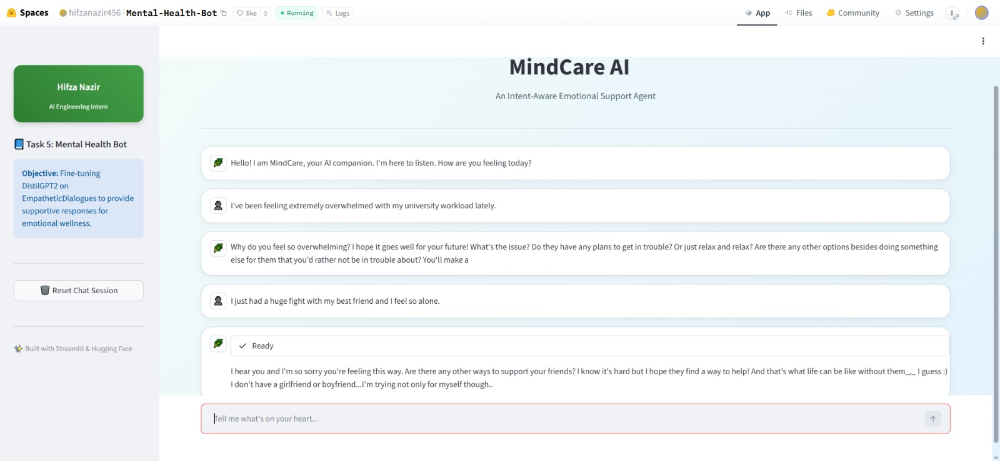
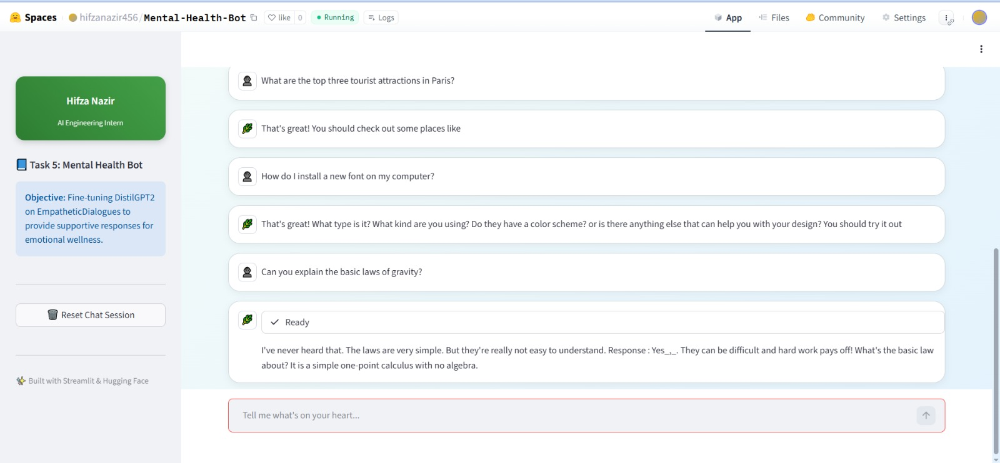
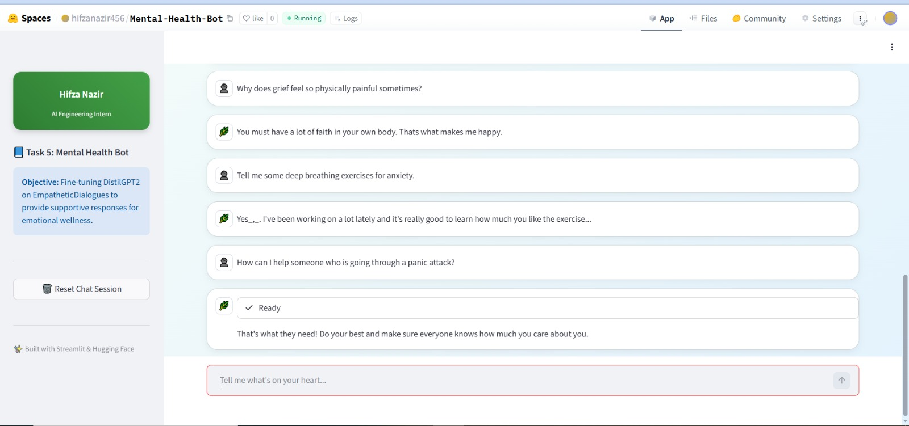

# 🌿 MindCare AI: Intent-Aware Mental Health Support Agent
### DevHub AI Engineering Internship — Task 5 (Final Project)
**Developed by: Hifza Nazir**

---

## 🎯 Project Objective
**MindCare AI** is engineered to bridge the gap between factual AI and human empathy. While standard Large Language Models (LLMs) prioritize information retrieval, MindCare AI is specifically fine-tuned to provide **supportive listening**, **emotional validation**, and **gentle guidance**.

By fine-tuning **DistilGPT2** on human-annotated emotional dialogues, this bot serves as a specialized tool for stress management, anxiety relief, and general emotional wellness.

---

## 🚀 Live Demo & Deployment
The application is successfully deployed and running on Hugging Face Spaces:  
👉 **[MindCare AI Live Space](https://huggingface.co/spaces/hifzanazir456/Mental-Health-Bot)**

---

## 📸 Project Showcase & Validation

### 1. Professional & Calming UI

*A clean, modern interface designed with a pastel-green theme to promote a sense of calm and focus for the user.*

### 2. Emotional Support (Empathy Check)

*The bot identifies emotional distress and responds with deep validation (e.g., "I hear you and I'm truly sorry you're feeling this way").*

### 3. The "Omelet Test" (Hallucination Guardrail)

*Demonstrating the bot’s ability to handle factual queries (recipes, travel, science) without hallucinating emotional advice.*

### 4. Intent-Aware Switching

*The system intelligently switches between "Support Mode" and "Information Mode" based on the context of the user's query.*

### 5. High-Stress Keyword Recognition

*Hard guardrails trigger immediate empathetic responses when sensitive keywords like "failure," "exam," or "alone" are detected.*

---

## 🚀 Advanced Technical Features

#### 🧠 1. Smart Intent Detection (The "Smart Switch")
A custom logic layer classifies user input before it reaches the AI model:
* **Mechanism:** Scans input for inquiry keywords (Who, What, How, Why, Tell me).
* **Impact:** Prevents the model from providing "sad" or "supportive" responses to purely factual questions.

#### 🛡️ 2. Hallucination Guardrails (Context Management)
Smaller models often struggle with context mixing. 
* **The Fix:** Implemented a **"Question Wrapper"** that forces the model into a factual "Answer Mode" when a general knowledge query is identified.

#### 🧘 3. Emotional Crisis Recognition
Identified specific "High-Risk" keywords that signal intense stress.
* **The Action:** When detected, a **Hard Guardrail** is triggered, ensuring the assistant leads with an empathetic acknowledgment to make the user feel heard.

---

## 🧬 Technical Stack & Implementation


| Component | Details |
| :--- | :--- |
| **Base Model** | **DistilGPT2** (82 Million Parameters) |
| **Dataset** | **EmpatheticDialogues** (Facebook AI Research) |
| **Libraries** | Hugging Face **Transformers**, **Trainer API**, **PyTorch** |
| **Interface** | **Streamlit** (Custom CSS/Theming) |
| **Final Loss** | **2.21** (Achieved through 3 epochs of rigorous fine-tuning) |

---

## 📂 Repository Structure
- `streamlit_app.py`: Main application code with Intent-Aware logic.
- `requirements.txt`: Python dependencies (Streamlit, Transformers, Torch).
- `Mental_Health_Bot_Task_5.ipynb`: The Google Colab notebook used for the fine-tuning process.
- `/Screenshots/`: Visual documentation of model testing and UI.

---

## 🛠️ Installation & Local Setup

1. **Clone the repository:**
   ```bash
   git clone [https://github.com/hifzanazir00781/DevHub_Internship_Task5_MentalHealthBot.git](https://github.com/hifzanazir00781/DevHub_Internship_Task5_MentalHealthBot.git)
